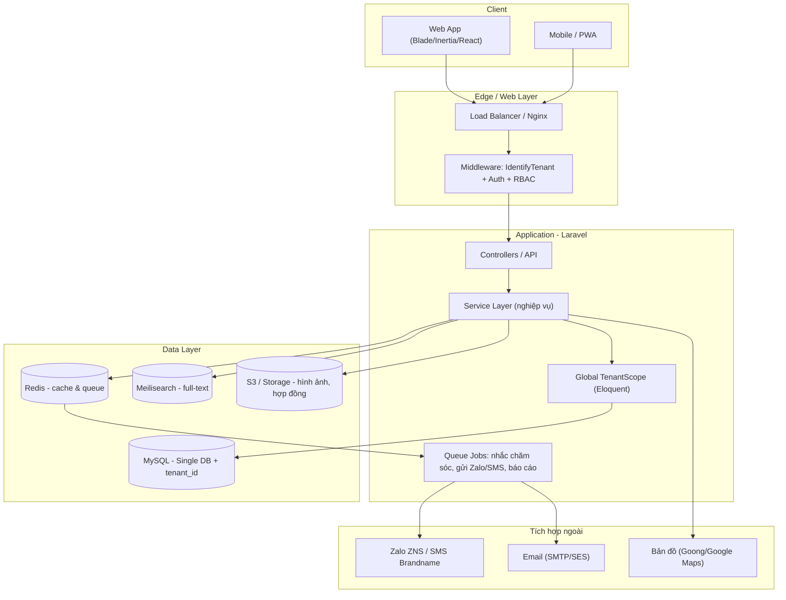
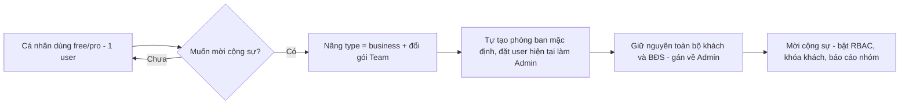
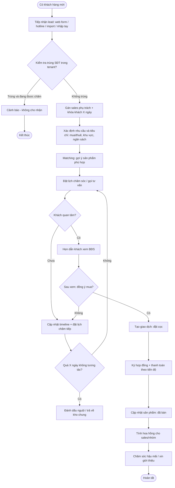
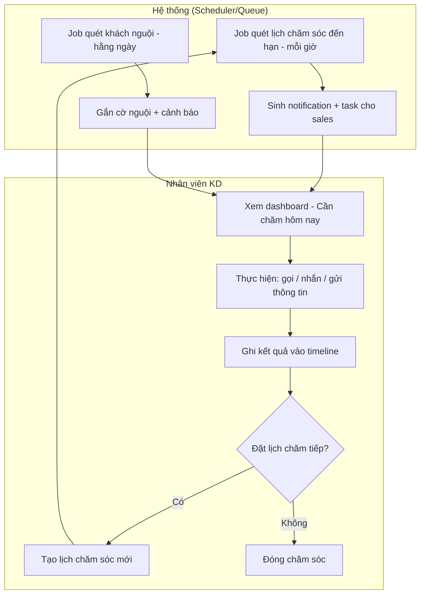
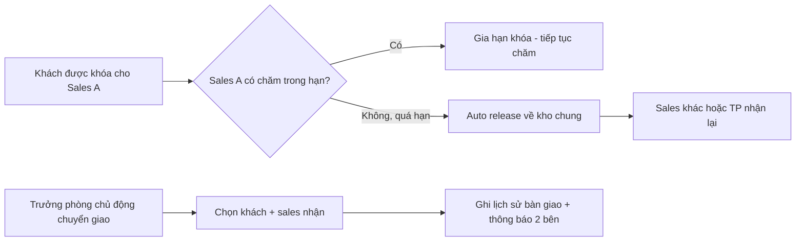
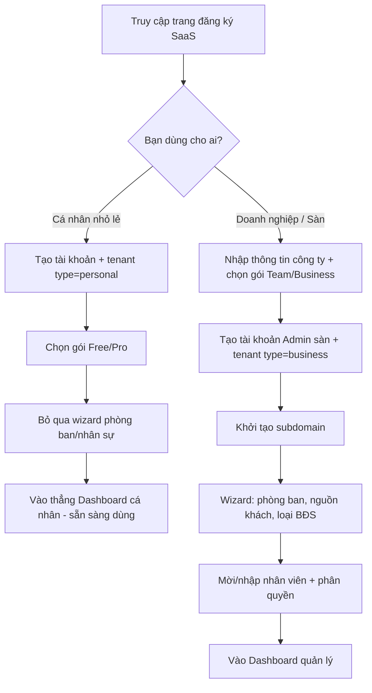
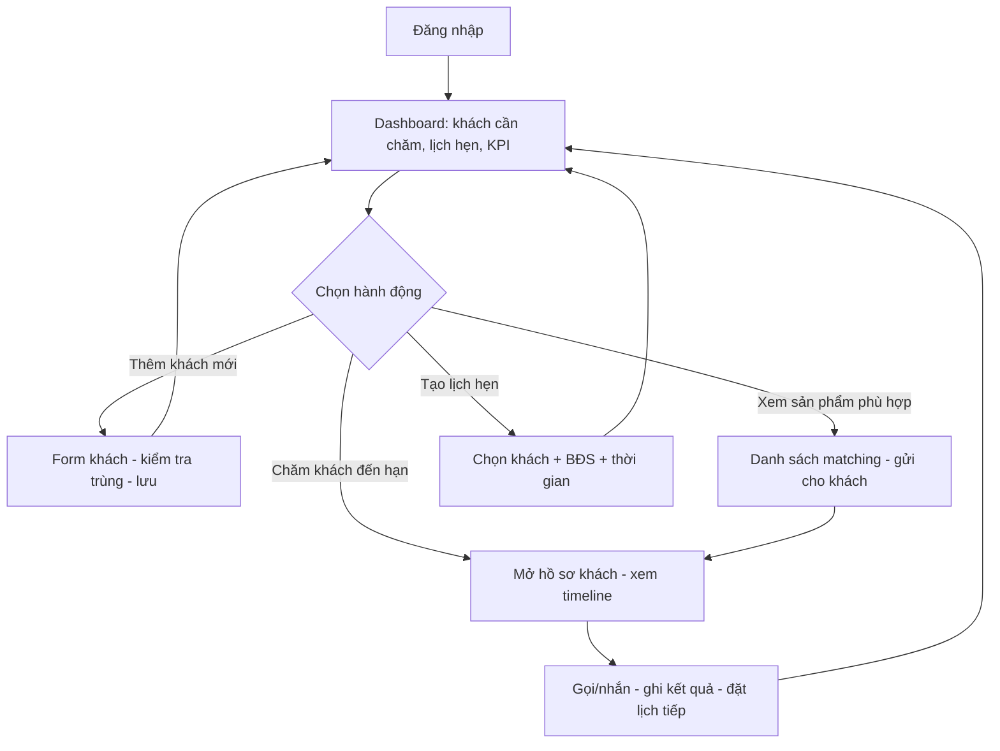
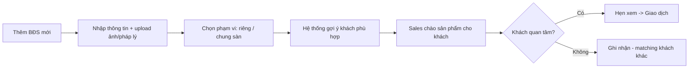
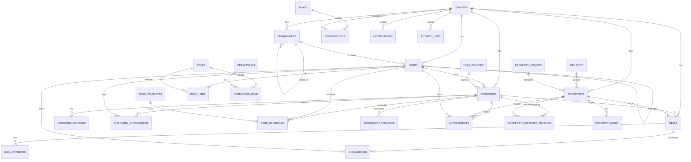

# ĐẶC TẢ PHẦN MỀM CRM BẤT ĐỘNG SẢN (Multi-tenant SaaS)

> **Tên hệ thống (tạm):** RealCRM — Phần mềm quản lý & chăm sóc khách hàng cho nhân viên kinh doanh bất động sản.
> **Mô hình:** Multi-tenant SaaS. Mỗi sàn giao dịch / công ty BĐS là một *tenant* với dữ liệu tách biệt, dùng chung một hệ thống.
> **Stack đề xuất:** PHP 8.x / Laravel 11, MySQL 8, Redis (queue + cache), Meilisearch (tìm kiếm), Laravel Horizon.

---

## Mục lục

1. [Tổng quan & mục tiêu](#1-tổng-quan--mục-tiêu)
2. [Danh sách chức năng](#2-danh-sách-chức-năng)
3. [Thiết kế kiến trúc Multi-tenant](#3-thiết-kế-kiến-trúc-multi-tenant)
4. [Mô tả chi tiết các chức năng](#4-mô-tả-chi-tiết-các-chức-năng)
5. [Quy trình nghiệp vụ (BPMN)](#5-quy-trình-nghiệp-vụ-bpmn)
6. [User Flow](#6-user-flow)
7. [Thiết kế Database — ERD](#7-thiết-kế-database--erd)
8. [Phân quyền (RBAC)](#8-phân-quyền-rbac)
9. [Roadmap triển khai theo giai đoạn](#9-roadmap-triển-khai-theo-giai-đoạn)

---

## 1. Tổng quan & mục tiêu

### 1.1. Bài toán
Nhân viên kinh doanh BĐS (sales/môi giới) hằng ngày phải:
- Quản lý hàng trăm khách hàng ở nhiều trạng thái nhu cầu khác nhau (mua, thuê, bán, ký gửi).
- Quản lý kho sản phẩm BĐS (giỏ hàng) với nhiều thuộc tính (loại hình, giá, diện tích, pháp lý, hướng…).
- **Matching** khách hàng với sản phẩm phù hợp.
- **Chủ động chăm sóc** khách theo lịch (gọi lại, nhắc hẹn, gửi thông tin) để không bỏ lỡ cơ hội chốt.
- Theo dõi tiến trình giao dịch tới khi thành công và nhận hoa hồng.

Excel/Zalo/sổ tay không đáp ứng được khi số lượng khách tăng và cần quản lý theo đội nhóm.

### 1.2. Mục tiêu hệ thống
- Số hóa toàn bộ vòng đời khách hàng (lead → chăm sóc → giao dịch → hậu mãi).
- **Chủ động nhắc chăm sóc**: hệ thống tự sinh nhắc việc, cảnh báo khách "nguội".
- Quản lý theo tenant (từng công ty/sàn) với dữ liệu cách ly hoàn toàn.
- Phân quyền theo vai trò: Admin sàn → Trưởng phòng → Nhân viên.
- Báo cáo hiệu suất theo cá nhân/nhóm/sàn.

### 1.3. Đối tượng sử dụng
| Vai trò | Mô tả |
|---|---|
| **Super Admin** | Chủ hệ thống SaaS. Quản lý tenant, gói dịch vụ, thanh toán, vận hành nền tảng. |
| **Tenant Admin (Chủ sàn)** | Quản trị cao nhất trong 1 công ty. Quản lý nhân sự, phân quyền, cấu hình. |
| **Trưởng nhóm/phòng** | Quản lý một đội sales, xem & điều phối khách/sản phẩm trong nhóm. |
| **Nhân viên KD (Sales)** | Người dùng chính. Quản lý khách, sản phẩm, chăm sóc, giao dịch của mình. |
| **Kế toán / CSKH (tuỳ chọn)** | Xử lý hợp đồng, thu chi, hoa hồng. |

---

## 2. Danh sách chức năng

### A. Nhóm chức năng nền tảng (SaaS / hệ thống)
1. **Quản lý Tenant** — đăng ký sàn mới, cấu hình subdomain, kích hoạt/khóa.
2. **Quản lý gói dịch vụ & giới hạn** (số user, số sản phẩm, số khách, dung lượng file).
3. **Thanh toán & gia hạn** (billing, hóa đơn, nhắc gia hạn).
4. **Onboarding tenant** — khởi tạo dữ liệu mẫu, wizard cấu hình ban đầu.
5. **Nhật ký hệ thống (audit log)** theo tenant.

### B. Quản lý người dùng & phân quyền
6. **Quản lý nhân viên** (thêm/sửa/khóa, gán phòng ban/nhóm).
7. **Phân quyền RBAC** (vai trò + quyền chi tiết theo module).
8. **Cơ cấu tổ chức** (phòng ban, nhóm, cây quản lý cấp trên–cấp dưới).
9. **Đăng nhập / bảo mật** (2FA tuỳ chọn, quên mật khẩu, phiên đăng nhập).

### C. Quản lý khách hàng (Core CRM)
10. **Danh bạ khách hàng** — hồ sơ đầy đủ, liên hệ, nguồn khách.
11. **Phân loại nhu cầu** (mua/thuê/bán/ký gửi) + tiêu chí tìm kiếm (khu vực, ngân sách, loại hình).
12. **Trạng thái phễu (pipeline)** — Lead mới → Đang chăm → Tiềm năng → Đàm phán → Chốt/Thất bại.
13. **Phân loại nóng/ấm/lạnh** (lead scoring) — chấm điểm mức độ quan tâm.
14. **Chống trùng & bảo vệ khách** — cảnh báo SĐT trùng, "khóa khách" theo nhân viên trong X ngày.
15. **Gán / chuyển giao khách** giữa nhân viên (có lịch sử bàn giao).
16. **Nguồn khách (lead source)** — thống kê hiệu quả kênh (Facebook, hotline, giới thiệu…).
17. **Import/Export** khách hàng (Excel/CSV).

### D. Quản lý bất động sản (Kho hàng / Giỏ hàng)
18. **Danh mục BĐS** — hồ sơ chi tiết: loại hình, giá, diện tích, pháp lý, hướng, số phòng…
19. **Hình ảnh / tài liệu / video** đính kèm.
20. **Trạng thái sản phẩm** — Còn / Đang cọc / Đã bán / Ngừng bán / Cho thuê.
21. **BĐS ký gửi** — liên kết với chủ nhà (owner) và khách ký gửi.
22. **Vị trí bản đồ** (lat/long, dự án, quận/huyện).
23. **Phân loại theo dự án** (project) — gom sản phẩm theo dự án/khu.
24. **Chia sẻ kho hàng nội bộ** — sản phẩm dùng chung toàn sàn hoặc riêng nhân viên.

### E. Matching & Chăm sóc chủ động (điểm khác biệt)
25. **Matching khách ↔ sản phẩm** — gợi ý sản phẩm phù hợp tiêu chí khách và ngược lại.
26. **Lịch chăm sóc & nhắc việc** — tạo lịch gọi/nhắn/hẹn, nhắc tự động.
27. **Cảnh báo khách nguội** — tự động nhắc khi khách quá X ngày không tương tác.
28. **Lịch sử tương tác** — timeline mọi cuộc gọi, tin nhắn, ghi chú, gặp mặt.
29. **Kịch bản chăm sóc (care template)** — mẫu nội dung gửi khách theo giai đoạn.
30. **Lịch hẹn dẫn khách xem nhà** (appointment) — có nhắc trước giờ hẹn.

### F. Giao dịch & hợp đồng
31. **Quản lý giao dịch (deal)** — từ đặt cọc → hợp đồng → thanh lý.
32. **Quản lý cọc/thanh toán** theo tiến độ.
33. **Tính hoa hồng** (commission) theo nhân viên/nhóm.
34. **Lưu trữ hợp đồng & tài liệu pháp lý**.

### G. Marketing & tương tác (mở rộng)
35. **Gửi Zalo/SMS/Email** hàng loạt theo phân khúc (tích hợp ZNS/SMS brandname).
36. **Landing page / đăng tin** đẩy sản phẩm ra kênh ngoài (tuỳ chọn).
37. **Form thu lead** từ website đổ về hệ thống.

### H. Báo cáo & Dashboard
38. **Dashboard cá nhân** — khách cần chăm hôm nay, lịch hẹn, KPI.
39. **Báo cáo hiệu suất** nhân viên/nhóm (số khách, cuộc gọi, giao dịch, doanh số).
40. **Báo cáo phễu bán hàng** (conversion theo từng bước).
41. **Báo cáo nguồn khách & doanh thu**.
42. **Xuất báo cáo** Excel/PDF.

### I. Tiện ích
43. **Thông báo (notification)** — in-app, email, push.
44. **Ứng dụng mobile / responsive** cho sales chạy thị trường.
45. **Tìm kiếm & lọc nâng cao** trên khách và sản phẩm.
46. **Ghi chú nhanh (quick note)** và đính kèm file.

---

## 3. Thiết kế kiến trúc Multi-tenant

### 3.1. Ba mô hình cách ly dữ liệu

| Mô hình | Cách ly | Ưu điểm | Nhược điểm | Phù hợp |
|---|---|---|---|---|
| **A. Single DB + `tenant_id`** (Shared database, shared schema) | Mọi tenant chung 1 DB, phân biệt bằng cột `tenant_id` | Rẻ, dễ vận hành, migrate 1 lần, dễ báo cáo cross-tenant | Rủi ro rò rỉ nếu quên filter, khó backup riêng 1 tenant | **Khởi đầu SaaS (khuyến nghị)** |
| **B. Database-per-tenant** | Mỗi tenant 1 database riêng | Cách ly mạnh, backup/khôi phục riêng, dễ scale theo khách lớn | Migrate phải chạy N lần, quản lý connection phức tạp | Khách enterprise, yêu cầu cách ly cao |
| **C. Schema-per-tenant** (Postgres) | Mỗi tenant 1 schema | Cân bằng giữa A và B | MySQL không hỗ trợ tốt như Postgres | Nếu dùng PostgreSQL |

### 3.2. Khuyến nghị: **Mô hình A (Single DB + `tenant_id`)** cho MVP

Lý do:
- Thị trường mục tiêu (sàn BĐS VN vừa & nhỏ) → tối ưu chi phí, tốc độ ra mắt.
- Dễ nâng cấp lên mô hình B sau này cho khách lớn ("hybrid": phần lớn tenant chung DB, tenant VIP tách DB).

**Nguyên tắc bắt buộc để an toàn:**
1. **Global Scope** trong Eloquent: mọi model có `tenant_id` tự động filter theo tenant hiện tại → lập trình viên không thể "quên" filter.
2. **Middleware xác định tenant** ngay đầu request (theo subdomain hoặc theo user đăng nhập).
3. **Tự động gán `tenant_id`** khi tạo bản ghi (qua model event `creating`).
4. **Khóa ngoại luôn kèm `tenant_id`** trong index để tối ưu và tránh join nhầm.

### 3.3. Cách xác định Tenant (Tenant Resolution)

- **Theo Subdomain:** `sanA.realcrm.vn`, `sanB.realcrm.vn` → tra bảng `tenants.subdomain`.
- **Hoặc theo User:** sau đăng nhập, lấy `tenant_id` từ user (đơn giản hơn cho MVP).
- Kết hợp cả hai: subdomain để nhận diện trang đăng nhập + phân giải tenant.

```
Request → Middleware IdentifyTenant → set Tenant context (singleton)
       → BootTenancy: cấu hình DB/cache prefix, đặt tenant() global
       → Controller/Model tự động scope theo tenant()->id
```

### 3.4. Sơ đồ kiến trúc tổng thể (Mermaid)



### 3.5. Scheduler & Queue (trái tim của "chăm sóc chủ động")

| Tác vụ nền | Chu kỳ | Mô tả |
|---|---|---|
| `care:generate-reminders` | Mỗi giờ | Quét lịch chăm sóc đến hạn → tạo notification/task cho sales. |
| `customers:detect-cold` | Hằng ngày | Đánh dấu khách "nguội" (quá X ngày không tương tác) → cảnh báo. |
| `customers:auto-release` | Hằng ngày | Trả khách về kho chung nếu bị "khóa" quá hạn mà không chăm. |
| `appointments:remind` | Mỗi 15 phút | Nhắc lịch hẹn dẫn khách trước giờ. |
| `reports:daily-summary` | Mỗi sáng | Gửi tổng hợp KPI hôm qua cho quản lý. |

> Tất cả job đều **lặp qua từng tenant** hoặc dùng cột `tenant_id` để giữ cách ly.

### 3.6. Phục vụ cả Doanh nghiệp lẫn Cá nhân nhỏ lẻ

**Ý tưởng chủ đạo:** *Cá nhân nhỏ lẻ = một tenant có đúng 1 user.* Không cần đổi kiến trúc cách ly dữ liệu; chỉ cần một cờ **`tenants.type`** để phân nhánh trải nghiệm và giới hạn tính năng.

| | Cá nhân (`type = personal`) | Doanh nghiệp / Sàn (`type = business`) |
|---|---|---|
| Số user | 1 | Nhiều |
| Phòng ban / nhóm | Không dùng | Có cây tổ chức |
| Phân quyền RBAC | Ẩn (mặc định full quyền cho chính mình) | Đầy đủ theo vai trò |
| Khóa/bảo vệ khách, bàn giao | Tắt (vô nghĩa với 1 người) | Bật |
| Kho BĐS chung/riêng | Chỉ có "của tôi" | Chung sàn + riêng nhân viên |
| Báo cáo | Cá nhân | Cá nhân + nhóm + toàn sàn |
| Onboarding | Tối giản, vào thẳng dashboard | Wizard đầy đủ (phòng ban, mời NV) |

**Nguyên tắc thiết kế để một codebase phục vụ cả hai:**

1. **Progressive disclosure (ẩn/hiện theo ngữ cảnh):** UI đọc `tenant.type` + `plan.features` để ẩn menu/nút không liên quan. Cá nhân không thấy Nhân sự, Phòng ban, Phân quyền, Chuyển giao khách, Báo cáo nhóm.
2. **Graceful degradation:** các nghiệp vụ đội nhóm (locking, auto-release, transfer) chỉ chạy khi `type = business`. Với personal, `assigned_user_id` luôn là chính chủ tài khoản.
3. **Feature gating theo gói:** kiểm tra quyền dùng tính năng qua `tenant->can('feature_key')` dựa trên `plan.features` (JSON) — không hard-code.

**Lối nâng cấp Solo → Team (không mất dữ liệu — điểm bán hàng chính):**



> Vì cả hai chế độ dùng chung `tenant_id`, việc "lên đời" chỉ là đổi cờ + tạo vài bản ghi mặc định — **không migrate dữ liệu, không đổi DB**.

### 3.7. Phân tầng gói dịch vụ (Plans)

| Gói | Đối tượng | User | Giới hạn chính | Tính năng nổi bật |
|---|---|---|---|---|
| **Free** | Cá nhân mới bắt đầu | 1 | ~100 khách, ~50 BĐS | Khách, BĐS, chăm sóc, nhắc việc, dashboard cá nhân |
| **Pro** | Cá nhân chuyên nghiệp | 1 | Không/ít giới hạn | Thêm: matching, Zalo/SMS cơ bản, báo cáo cá nhân, import/export |
| **Team** | Sàn nhỏ / nhóm | tới ~10–20 | Theo gói | Thêm: phòng ban, RBAC, khóa & chuyển giao khách, kho chung, báo cáo nhóm |
| **Business / Enterprise** | Sàn lớn | Không giới hạn | Cao/tùy chỉnh | Thêm: tích hợp sâu, custom domain, tách DB (hybrid), hỗ trợ ưu tiên, audit nâng cao |

> `plans.features` (JSON) là "nguồn sự thật" để bật/tắt tính năng. `plans.max_users`, `max_customers`, `max_properties`, `storage_mb` áp hạn mức. Personal Free đơn giản là `max_users = 1` + `features` rút gọn.

---

## 4. Mô tả chi tiết các chức năng

### 4.1. Quản lý khách hàng (Customer)

**Mục đích:** Lưu trữ toàn bộ thông tin khách và nhu cầu để chăm sóc và matching.

**Thông tin lưu trữ:**
- Cơ bản: họ tên, SĐT (chính + phụ), email, giới tính, năm sinh, địa chỉ, nghề nghiệp.
- Nguồn khách: Facebook, hotline, giới thiệu, website, sự kiện, khác.
- Nhu cầu: `buy` (mua) / `rent` (thuê) / `sell` (bán) / `consign` (ký gửi).
- Tiêu chí: loại hình mong muốn, khu vực (tỉnh/quận), ngân sách (min–max), diện tích, số phòng ngủ, hướng, mục đích (ở/đầu tư).
- Trạng thái pipeline + điểm quan tâm (nóng/ấm/lạnh).
- Sales phụ trách + ngày nhận + hạn "khóa khách".

**Nghiệp vụ chính:**
- **Chống trùng:** khi tạo/nhập khách, kiểm tra SĐT trong tenant. Nếu trùng và đang được người khác chăm → cảnh báo, không cho cướp khách.
- **Bảo vệ khách (customer locking):** khi 1 sales nhận khách, khách bị "khóa" X ngày (cấu hình). Sales khác không thấy hoặc không được liên hệ. Nếu quá hạn không chăm → tự trả về kho chung.
- **Chuyển giao khách:** trưởng nhóm/admin gán lại khách; lưu lịch sử bàn giao.
- **Lead scoring:** tự động/thủ công tính điểm dựa trên tần suất tương tác, mức độ phản hồi, giai đoạn.

### 4.2. Quản lý bất động sản (Property)

**Mục đích:** Kho sản phẩm để môi giới và matching.

**Thông tin lưu trữ:**
- Loại hình: căn hộ, nhà phố, biệt thự, đất nền, shophouse, đất nông nghiệp, kho xưởng, văn phòng…
- Hình thức: bán / cho thuê.
- Giá (tổng và/hoặc theo m²), diện tích (đất, xây dựng), số phòng ngủ/WC, số tầng.
- Hướng nhà, hướng ban công, mặt tiền, đường vào.
- Pháp lý: sổ đỏ, sổ hồng, HĐMB, vi bằng, đang chờ sổ…
- Nội thất: bàn giao thô / cơ bản / đầy đủ.
- Vị trí: tỉnh/quận/phường, địa chỉ, dự án, tọa độ (lat/long).
- Chủ nhà (owner) nếu là hàng ký gửi.
- Media: ảnh, video, tài liệu.
- Trạng thái: còn hàng / đang cọc / đã bán / đã cho thuê / ngừng.
- Phạm vi: dùng chung toàn sàn hay riêng nhân viên.

### 4.3. Matching khách ↔ sản phẩm

**Cách hoạt động:**
- Với 1 khách đang có nhu cầu mua → hệ thống lọc các BĐS thỏa: cùng loại hình, khu vực trùng, giá nằm trong [min, max], diện tích/số phòng phù hợp.
- Với 1 sản phẩm mới thêm → gợi ý danh sách khách có tiêu chí khớp để sales gọi chào.
- Sắp xếp theo độ khớp (matching score). Cho phép sales "gửi sản phẩm" cho khách và ghi nhận vào timeline.

### 4.4. Chăm sóc chủ động & Nhắc việc (điểm cốt lõi)

**Care Schedule (lịch chăm sóc):**
- Sales đặt lịch cho từng khách: loại (gọi lại / nhắn Zalo / gửi thông tin / hẹn gặp), ngày giờ, nội dung.
- Đến hạn → hệ thống tạo **notification + task** hiển thị trên dashboard "Cần chăm hôm nay".
- Sau khi làm việc → sales cập nhật kết quả → ghi vào **timeline tương tác** → có thể đặt lịch chăm tiếp theo.

**Cảnh báo khách nguội:**
- Job hằng ngày quét khách chưa có tương tác trong X ngày (theo cấu hình từng giai đoạn) → gắn cờ "nguội" và nhắc sales.

**Kịch bản chăm sóc (template):**
- Mẫu nội dung theo giai đoạn (chào mừng, follow-up, ưu đãi, tái tiếp cận) → chèn biến `{{ten_khach}}`, `{{san_pham}}`.

### 4.5. Lịch hẹn dẫn khách (Appointment)

- Tạo lịch: khách + (tuỳ chọn) sản phẩm + thời gian + địa điểm.
- Nhắc trước giờ hẹn cho sales (và khách nếu tích hợp Zalo).
- Cập nhật kết quả sau buổi hẹn (đã đi / hoãn / khách không đến / quan tâm).

### 4.6. Giao dịch & Hoa hồng (Deal)

- Tạo deal khi khách chốt 1 sản phẩm: giá bán thực tế, các mốc thanh toán/cọc.
- Trạng thái: cọc → hợp đồng → hoàn tất / hủy.
- Tính hoa hồng theo % hoặc mức cố định, chia cho sales/nhóm.
- Sản phẩm liên quan tự chuyển trạng thái (đang cọc → đã bán).

### 4.7. Báo cáo & Dashboard

- **Dashboard sales:** khách cần chăm hôm nay, lịch hẹn, số khách theo giai đoạn, KPI tháng.
- **Dashboard quản lý:** hiệu suất từng nhân viên, phễu bán hàng, doanh số, nguồn khách hiệu quả.
- Bộ lọc theo thời gian, phòng ban, nhân viên. Xuất Excel/PDF.


---

## 5. Quy trình nghiệp vụ (BPMN)

> Diễn đạt bằng sơ đồ Mermaid (flowchart) theo tinh thần BPMN. Mỗi swimlane tương ứng một vai trò.

### 5.1. Quy trình tổng: Vòng đời khách hàng (Lead → Chốt)



### 5.2. Quy trình con: Chăm sóc chủ động (có swimlane)



### 5.3. Quy trình con: Bàn giao / thu hồi khách



---

## 6. User Flow

### 6.1. Onboarding — phân nhánh Cá nhân / Doanh nghiệp



> Cùng một endpoint đăng ký, chỉ khác nhánh theo lựa chọn ban đầu. Cá nhân có thể **nâng cấp lên doanh nghiệp bất cứ lúc nào** (xem mục 3.6) mà không mất dữ liệu.

### 6.2. Luồng nhân viên xử lý khách hàng hằng ngày



### 6.3. Luồng thêm & môi giới một BĐS




---

## 7. Thiết kế Database — ERD

> Quy ước: bảng số nhiều, snake_case (Laravel). **Mọi bảng nghiệp vụ đều có `tenant_id`** (trừ các bảng cấp hệ thống: `tenants`, `plans`, và danh mục hành chính dùng chung). Đều có `created_at`, `updated_at`; các bảng quan trọng có `deleted_at` (soft delete).

### 7.1. Sơ đồ ERD (Mermaid)



### 7.2. Từ điển dữ liệu (Data Dictionary) — các bảng chính

#### `tenants` — Công ty / sàn giao dịch
| Cột | Kiểu | Ghi chú |
|---|---|---|
| id | BIGINT PK | |
| name | VARCHAR | Tên công ty/sàn |
| subdomain | VARCHAR UNIQUE | vd: sanA → sanA.realcrm.vn |
| domain | VARCHAR NULL | Tên miền riêng (tuỳ chọn) |
| logo | VARCHAR NULL | |
| phone, email, address | VARCHAR | Thông tin liên hệ |
| type | ENUM(personal, business) DEFAULT personal | **Cá nhân nhỏ lẻ vs Doanh nghiệp/sàn** — phân nhánh UI & tính năng |
| status | ENUM(active, suspended, trial) | Trạng thái |
| trial_ends_at | TIMESTAMP NULL | |
| settings | JSON NULL | Cấu hình riêng (số ngày khóa khách, ngày nguội…) |
| created_at, updated_at | TIMESTAMP | |

#### `plans` / `subscriptions` — Gói & thuê bao
`plans`: id, name, `slug`(free/pro/team/business), `target_type`(personal/business/both — gợi ý gói cho cá nhân hay doanh nghiệp), price, billing_cycle(month/year), max_users, max_customers, max_properties, storage_mb, features(JSON — nguồn sự thật để bật/tắt tính năng).
`subscriptions`: id, **tenant_id**, plan_id, status(active/expired/canceled), starts_at, ends_at, price, created_at.

> Gói Free (cá nhân) = `max_users = 1`, `target_type = personal`, `features` rút gọn. Khi tenant `personal` nâng lên gói `team/business`, đổi luôn `tenants.type = business`.

#### `users` — Nhân viên
| Cột | Kiểu | Ghi chú |
|---|---|---|
| id | BIGINT PK | |
| **tenant_id** | BIGINT FK | Cách ly tenant |
| department_id | BIGINT FK NULL | Phòng/nhóm |
| manager_id | BIGINT FK NULL (users.id) | Cấp trên trực tiếp |
| name, email(unique per tenant), password | | |
| phone, avatar | VARCHAR NULL | |
| status | ENUM(active, inactive) | |
| last_login_at | TIMESTAMP NULL | |
| created_at, updated_at, deleted_at | | Soft delete |

#### `departments` — Phòng ban / nhóm
id, **tenant_id**, name, parent_id (FK self, cây tổ chức), leader_id (FK users), created_at.

#### `lead_sources` — Nguồn khách
id, **tenant_id**, name (Facebook/Hotline/Giới thiệu…), is_active.

#### `customers` — Khách hàng
| Cột | Kiểu | Ghi chú |
|---|---|---|
| id | BIGINT PK | |
| **tenant_id** | BIGINT FK | |
| assigned_user_id | BIGINT FK NULL | Sales phụ trách |
| lead_source_id | BIGINT FK NULL | |
| full_name | VARCHAR | |
| phone | VARCHAR (index) | Dùng chống trùng |
| phone_alt | VARCHAR NULL | |
| email | VARCHAR NULL | |
| gender | ENUM(male,female,other) NULL | |
| birth_year | SMALLINT NULL | |
| address | VARCHAR NULL | |
| occupation | VARCHAR NULL | |
| pipeline_stage | ENUM(new, contacting, potential, negotiating, won, lost) | Phễu |
| temperature | ENUM(hot, warm, cold) | Nóng/ấm/lạnh |
| lead_score | SMALLINT DEFAULT 0 | Điểm quan tâm |
| locked_until | TIMESTAMP NULL | Hạn khóa khách |
| last_interaction_at | TIMESTAMP NULL | Phục vụ cảnh báo nguội |
| is_cold_flagged | BOOLEAN DEFAULT 0 | |
| note | TEXT NULL | |
| created_at, updated_at, deleted_at | | |

*Index gợi ý:* `(tenant_id, phone)`, `(tenant_id, assigned_user_id)`, `(tenant_id, pipeline_stage)`.

#### `customer_demands` — Nhu cầu / tiêu chí (1 khách có thể nhiều nhu cầu)
| Cột | Kiểu | Ghi chú |
|---|---|---|
| id | BIGINT PK | |
| **tenant_id** | BIGINT FK | |
| customer_id | BIGINT FK | |
| demand_type | ENUM(buy, rent, sell, consign) | |
| property_type | VARCHAR/ENUM | căn hộ, đất nền, nhà phố… |
| purpose | ENUM(live, invest) NULL | Ở / đầu tư |
| province_code, district_code | VARCHAR NULL | Khu vực mong muốn |
| budget_min, budget_max | DECIMAL(15,2) NULL | Ngân sách |
| area_min, area_max | DECIMAL(8,2) NULL | m² |
| bedrooms_min | TINYINT NULL | |
| direction | VARCHAR NULL | Hướng |
| is_active | BOOLEAN DEFAULT 1 | |

#### `projects` — Dự án
id, **tenant_id**, name, developer(chủ đầu tư) NULL, province_code, district_code, address, description, created_at.

#### `property_owners` — Chủ nhà (hàng ký gửi)
id, **tenant_id**, full_name, phone, email NULL, note NULL, created_at.

#### `properties` — Bất động sản
| Cột | Kiểu | Ghi chú |
|---|---|---|
| id | BIGINT PK | |
| **tenant_id** | BIGINT FK | |
| project_id | BIGINT FK NULL | |
| owner_id | BIGINT FK NULL | Chủ nhà ký gửi |
| created_by | BIGINT FK (users) | Người đăng |
| code | VARCHAR | Mã sản phẩm nội bộ |
| title | VARCHAR | Tiêu đề |
| property_type | ENUM/VARCHAR | Loại hình |
| transaction_type | ENUM(sale, rent) | Bán / cho thuê |
| price | DECIMAL(15,2) | Giá tổng |
| price_per_m2 | DECIMAL(15,2) NULL | |
| area_land | DECIMAL(8,2) NULL | Diện tích đất |
| area_usable | DECIMAL(8,2) NULL | DT sử dụng/xây dựng |
| bedrooms, bathrooms, floors | TINYINT NULL | |
| direction | VARCHAR NULL | Hướng nhà |
| legal_status | ENUM(red_book, pink_book, sale_contract, waiting, other) NULL | Pháp lý |
| furniture | ENUM(none, basic, full) NULL | Nội thất |
| province_code, district_code, ward_code | VARCHAR NULL | |
| address | VARCHAR NULL | |
| latitude, longitude | DECIMAL NULL | Bản đồ |
| description | TEXT NULL | |
| visibility | ENUM(private, shared) | Riêng / chung sàn |
| status | ENUM(available, deposited, sold, rented, inactive) | |
| created_at, updated_at, deleted_at | | |

*Index gợi ý:* `(tenant_id, status)`, `(tenant_id, property_type, transaction_type)`, `(tenant_id, province_code, district_code)`, `(tenant_id, price)`.

#### `property_media` — Ảnh / tài liệu / video
id, **tenant_id**, property_id, type(image/video/document), path, sort_order.

#### `property_customer_matches` — Matching & gửi sản phẩm cho khách
| Cột | Kiểu | Ghi chú |
|---|---|---|
| id | BIGINT PK | |
| **tenant_id** | BIGINT FK | |
| customer_id | BIGINT FK | |
| property_id | BIGINT FK | |
| match_score | SMALLINT NULL | Độ khớp |
| status | ENUM(suggested, sent, interested, rejected) | |
| sent_by | BIGINT FK (users) NULL | |
| sent_at | TIMESTAMP NULL | |

#### `customer_interactions` — Timeline tương tác
| Cột | Kiểu | Ghi chú |
|---|---|---|
| id | BIGINT PK | |
| **tenant_id** | BIGINT FK | |
| customer_id | BIGINT FK | |
| user_id | BIGINT FK | Người thực hiện |
| type | ENUM(call, sms, zalo, email, meeting, note, viewing) | |
| content | TEXT | Nội dung/kết quả |
| direction | ENUM(in, out) NULL | Gọi đến/đi |
| interacted_at | TIMESTAMP | |
| created_at | | |

#### `care_schedules` — Lịch chăm sóc / nhắc việc
| Cột | Kiểu | Ghi chú |
|---|---|---|
| id | BIGINT PK | |
| **tenant_id** | BIGINT FK | |
| customer_id | BIGINT FK | |
| assigned_user_id | BIGINT FK | Sales chịu trách nhiệm |
| care_template_id | BIGINT FK NULL | |
| type | ENUM(call, sms, zalo, email, meeting) | |
| scheduled_at | TIMESTAMP (index) | Thời điểm cần chăm |
| content | TEXT NULL | |
| status | ENUM(pending, done, missed, canceled) | |
| completed_at | TIMESTAMP NULL | |
| result_note | TEXT NULL | |

*Index gợi ý:* `(tenant_id, scheduled_at, status)`, `(tenant_id, assigned_user_id, status)`.

#### `care_templates` — Kịch bản chăm sóc
id, **tenant_id**, name, channel(call/sms/zalo/email), content(có biến {{ten_khach}}), stage NULL, is_active.

#### `appointments` — Lịch hẹn dẫn khách
id, **tenant_id**, customer_id, property_id NULL, user_id, scheduled_at, location NULL, status(scheduled, done, canceled, no_show), result_note NULL, remind_at NULL.

#### `customer_transfers` — Lịch sử bàn giao khách
id, **tenant_id**, customer_id, from_user_id NULL, to_user_id, transferred_by, reason NULL, created_at.

#### `deals` — Giao dịch
| Cột | Kiểu | Ghi chú |
|---|---|---|
| id | BIGINT PK | |
| **tenant_id** | BIGINT FK | |
| customer_id | BIGINT FK | Khách mua/thuê |
| property_id | BIGINT FK | |
| user_id | BIGINT FK | Sales chốt |
| deal_type | ENUM(sale, rent) | |
| final_price | DECIMAL(15,2) | Giá thực tế |
| status | ENUM(deposit, contract, completed, canceled) | |
| deposit_amount | DECIMAL(15,2) NULL | |
| closed_at | TIMESTAMP NULL | |
| note | TEXT NULL | |
| created_at, updated_at | | |

#### `deal_payments` — Thanh toán theo tiến độ
id, **tenant_id**, deal_id, amount, paid_at, method(cash/transfer), note.

#### `commissions` — Hoa hồng
id, **tenant_id**, deal_id, user_id, amount, rate NULL, status(pending, approved, paid), created_at.

#### Phân quyền: `roles`, `permissions`, `role_user`, `permission_role`
- `roles`: id, **tenant_id** (NULL nếu vai trò hệ thống mặc định), name, guard.
- `permissions`: id, name (vd `customer.view`, `property.edit`), module.
- `role_user`: user_id, role_id, tenant_id.
- `permission_role`: role_id, permission_id.
> Có thể dùng package **spatie/laravel-permission** (bảng `model_has_roles`, `role_has_permissions`) kết hợp thêm cột `tenant_id` để cách ly.

#### Hệ thống: `notifications`, `activity_logs`
- `notifications` (chuẩn Laravel): id(uuid), type, notifiable, data(JSON), read_at + thêm **tenant_id**.
- `activity_logs`: id, **tenant_id**, user_id, action, subject_type, subject_id, properties(JSON), created_at → phục vụ audit.

#### Danh mục hành chính (dùng chung, không tenant_id)
`provinces`(code, name), `districts`(code, province_code, name), `wards`(code, district_code, name).


---

## 8. Phân quyền (RBAC)

### 8.1. Ma trận quyền (rút gọn)

| Module / Hành động | Super Admin | Tenant Admin | Trưởng nhóm | Sales |
|---|:---:|:---:|:---:|:---:|
| Quản lý tenant, gói | ✅ | – | – | – |
| Quản lý nhân sự, phân quyền | – | ✅ | – | – |
| Cấu hình sàn (nguồn khách, loại BĐS…) | – | ✅ | – | – |
| Xem khách toàn sàn | – | ✅ | Nhóm mình | Của mình |
| Thêm/sửa khách | – | ✅ | ✅ | ✅ (của mình) |
| Chuyển giao / thu hồi khách | – | ✅ | ✅ (trong nhóm) | – |
| Xem kho BĐS chung | – | ✅ | ✅ | ✅ |
| Thêm/sửa BĐS | – | ✅ | ✅ | ✅ (của mình) |
| Tạo giao dịch, duyệt hoa hồng | – | ✅ | ✅ (xem) | ✅ (tạo) |
| Báo cáo toàn sàn | – | ✅ | Nhóm mình | Cá nhân |

### 8.2. Nguyên tắc data-scope theo cấp
- **Sales:** chỉ thấy khách/BĐS do mình phụ trách + kho chung.
- **Trưởng nhóm:** thấy toàn bộ dữ liệu của các thành viên trong `department` mình quản lý (dựa `manager_id`/`department_id`).
- **Tenant Admin:** toàn bộ dữ liệu trong `tenant_id`.
- **Super Admin:** cấp nền tảng, không truy cập dữ liệu nghiệp vụ tenant (trừ hỗ trợ có kiểm soát).

> Kết hợp **RBAC (vai trò)** + **Data Scope (phạm vi dữ liệu)** ở tầng Query/Policy (Laravel Policies + Global Scopes).

---

## 9. Roadmap triển khai theo giai đoạn

### Giai đoạn 1 — MVP (cốt lõi CRM)
- Multi-tenant nền tảng (tenant, user, RBAC cơ bản, subdomain).
- Quản lý khách hàng + chống trùng + khóa khách.
- Quản lý BĐS + media + kho chung/riêng.
- Timeline tương tác + lịch chăm sóc + nhắc việc (scheduler/queue).
- Dashboard "cần chăm hôm nay" + báo cáo cơ bản.

### Giai đoạn 2 — Bán hàng & tự động
- Matching khách ↔ sản phẩm.
- Lịch hẹn dẫn khách + nhắc trước giờ.
- Giao dịch, thanh toán, hoa hồng.
- Cảnh báo khách nguội + auto-release.
- Báo cáo phễu + hiệu suất nhóm.

### Giai đoạn 3 — Marketing & mở rộng
- Tích hợp Zalo ZNS / SMS brandname / Email hàng loạt.
- Form thu lead từ website → tự đổ vào hệ thống.
- Ứng dụng mobile/PWA cho sales chạy thị trường.
- Bản đồ BĐS, đăng tin ra kênh ngoài.
- Gói dịch vụ nâng cao + hybrid multi-tenant (tách DB cho khách lớn).

---

## Phụ lục — Lưu ý kỹ thuật khi lập trình (Laravel)

1. **Trait `BelongsToTenant`** gắn vào mọi Model có `tenant_id`:
   - `booted()`: thêm `addGlobalScope(new TenantScope)` và event `creating` tự set `tenant_id = tenant()->id`.
2. **Middleware `IdentifyTenant`** đặt tenant hiện tại vào container (singleton) theo subdomain hoặc user.
3. **Không bao giờ** truy vấn trực tiếp bằng raw query bỏ qua scope trong luồng người dùng.
4. **Queue/Job**: truyền `tenant_id` vào job và khôi phục context tenant khi chạy nền.
5. **Unique per tenant**: các ràng buộc unique (email user, code BĐS…) nên là composite `(tenant_id, ...)`.
5b. **Phân nhánh personal/business**: gom logic vào `tenant->isBusiness()` / `tenant->can('feature')`; Policy và Blade/Frontend đọc cờ này để ẩn/tắt tính năng đội nhóm, tránh rải rác `if` khắp nơi.
6. **Migration** thêm index tổng hợp bắt đầu bằng `tenant_id` cho hiệu năng.
7. **Cache/Session/Storage** nên prefix theo `tenant_id` để tránh lẫn.

---

*Tài liệu này là bản đặc tả khởi tạo. Có thể mở rộng thêm: đặc tả API (OpenAPI), wireframe UI, và test cases cho từng chức năng.*
